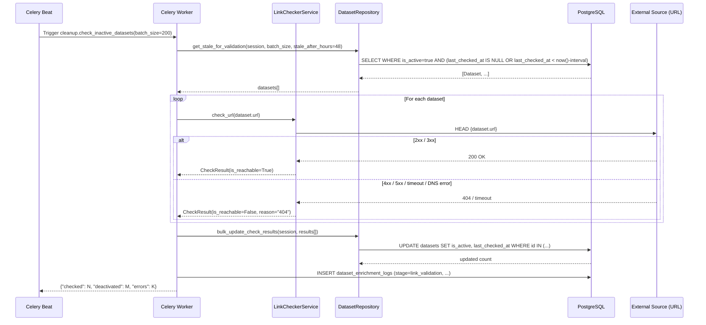
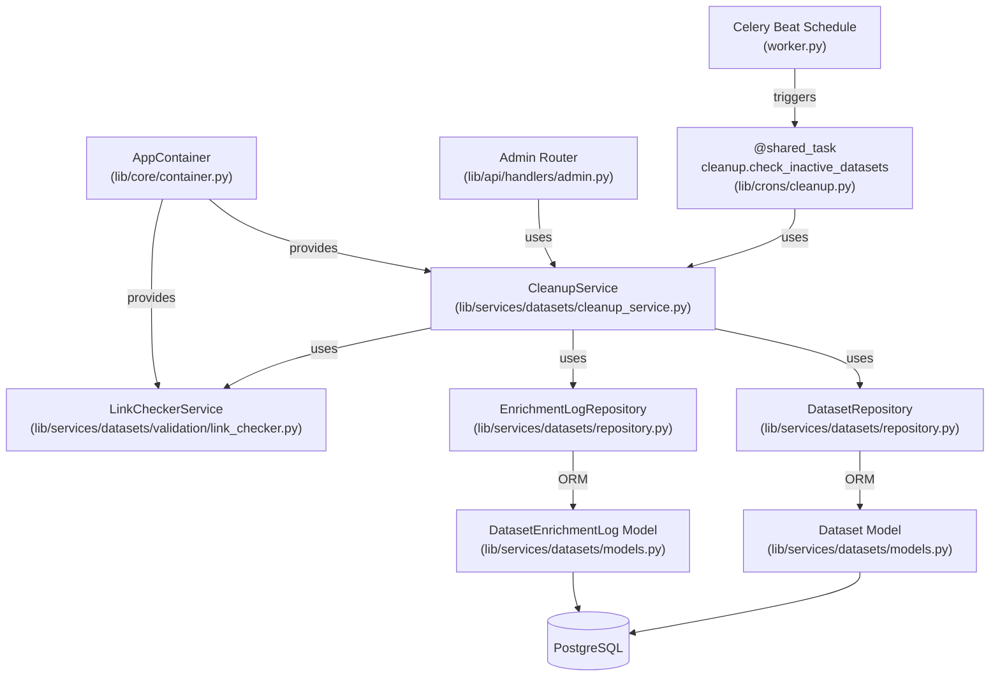

# System Design Document: Dataset Cleanup Feature

**Status:** Draft  
**Author:** [author_name]  
**Date:** 2026-04-17  
**Branch:** `feature/cleanup-datasets`

---

## 1. Обзор (Overview)

### Описание фичи

DataSearch агрегирует датасеты из внешних источников (Kaggle, HuggingFace, OpenML). В настоящее время система не имеет механизма очистки устаревших датасетов: если датасет был удалён или стал недоступен на платформе-источнике, он продолжает отображаться в поиске. Пользователи получают нерелевантные результаты и переходят по битым ссылкам.

Данная фича реализует **автоматическую очистку неактивных датасетов** через фоновый Celery-сервис: периодически проверяет доступность URL датасетов методом HEAD-запросов, помечает недоступные как `is_active = false` и исключает их из поисковой выдачи.

### Бизнес-цели и метрики успеха

| Метрика | Цель |
|---|---|
| Доля битых ссылок в поисковой выдаче | ≤ 1% |
| Время обнаружения недоступного датасета после его удаления на источнике | ≤ 48 часов |
| Доля false-positive деактивации (активный датасет помечен неактивным) | ≤ 0.5% |
| Покрытие проверки (% активных датасетов, проверенных за 48 часов) | 100% |

---

## 2. Цели и Анти-цели (Goals and Non-Goals)

### Цели (Goals)

- Реализовать Celery-задачу `cleanup.check_inactive_datasets`, которая батчами проверяет доступность URL активных датасетов
- Реализовать `LinkCheckerService` — сервис для HEAD-проверок URL с retry-логикой и обработкой таймаутов
- Добавить в `DatasetRepository` методы для выборки датасетов, требующих проверки (`get_stale_for_validation`), и батчевого обновления `is_active` + `last_checked_at`
- Заполнить существующий stub `cleanup.check_broken_links` в `lib/crons/cleanup.py` реальной реализацией
- Расширить эндпоинт `GET /api/visit/{dataset_id}`: при переходе пользователя выполнять inline HEAD-проверку URL; если датасет недоступен — немедленно деактивировать и вернуть `404`
- Добавить эндпоинт `POST /api/admin/datasets/cleanup/trigger` для ручного запуска проверки (только для admin-пользователей)
- Добавить эндпоинт `GET /api/admin/datasets/cleanup/stats` для просмотра статистики проверок
- Логировать все события деактивации с причиной (HTTP-статус, таймаут, DNS-ошибка) через существующую `DatasetEnrichmentLog` с новым `EnrichmentStage.LINK_VALIDATION`
- Зарегистрировать задачу в `beat_schedule` воркера с периодичностью раз в 2 дня
- Реализовать per-domain rate limiting в `LinkCheckerService` для предотвращения блокировок со стороны источников

### Анти-цели (Non-Goals)

- **Отдельный сервис реактивации** — реактивация реализуется в рамках существующего enrichment-пайплайна: при upsert датасета, если запись уже есть в БД с `is_active=false`, проставляется `is_active=true` (без создания новой записи)
- **Уведомления пользователей** об удалении датасета из избранного — отдельная фича
- **Проверка корректности содержимого** (content validation) по URL — только проверка доступности (HTTP 2xx/3xx)
- **Удаление записей** из БД — только мягкая деактивация через флаг `is_active`
- **Поддержка источников без публичных URL** — в данной итерации только HTTP(S) ссылки

---

## 3. Высокоуровневый дизайн (High-Level Design)

### Sequence Diagram



### Основной флоу

1. Celery Beat по расписанию (каждые 48 часов) триггерит задачу `cleanup.check_inactive_datasets`.
2. Задача через `DatasetRepository.get_stale_for_validation()` выбирает батч активных датасетов, чей `last_checked_at` устарел или `NULL`.
3. `LinkCheckerService` выполняет параллельные HEAD-запросы (через `asyncio.gather` с ограниченным concurrency и per-domain rate limiting) к URL каждого датасета.
4. По итогу каждой проверки формируется `LinkCheckResult` с флагом `is_reachable` и причиной.
5. Датасеты с `is_reachable=False` помечаются `is_active=False`; для всех обновляется `last_checked_at`.
6. Каждая проверка логируется в `dataset_enrichment_logs` со stage `link_validation`.
7. Задача возвращает сводную статистику в Celery backend.

---

## 4. Детальный дизайн (Detailed Design)

### 4.1. Диаграмма компонентов (Component Diagram)



### 4.2. Изменения в схеме данных (Database Schema Changes)

#### Таблица `datasets` — изменения существующей таблицы

Поля `is_active` и `last_checked_at` **уже существуют** в модели `Dataset`. Никаких DDL-изменений не требуется. Необходимо только добавить составной индекс для оптимизации выборки датасетов к проверке:

```sql
-- Новый индекс для эффективной выборки датасетов, требующих проверки
CREATE INDEX CONCURRENTLY idx_datasets_active_last_checked
    ON datasets (is_active, last_checked_at NULLS FIRST)
    WHERE is_active = true;
```

Соответствующее добавление в `__table_args__` модели `Dataset`:

```python
Index(
    "idx_datasets_active_last_checked",
    "is_active",
    "last_checked_at",
    postgresql_where=(text("is_active = true"))
)
```

#### Таблица `dataset_enrichment_logs` — без изменений

Существующая модель `DatasetEnrichmentLog` полностью покрывает нужды логирования. Используем `stage=EnrichmentStage.LINK_VALIDATION` (уже определён в `EnrichmentStage`) и `result=EnrichmentResult.SUCCESS | FAILED`.

Поле `error_message` будет содержать HTTP-статус или тип ошибки (`"404"`, `"timeout"`, `"dns_error"`).

#### Enum `EnrichmentStage` — без изменений

`LINK_VALIDATION = "link_validation"` уже определён в `lib/services/datasets/models.py:EnrichmentStage`.

### 4.3. API Endpoints

#### GET /api/visit/{dataset_id} — изменение существующего эндпоинта

Существующий эндпоинт редиректа (`lib/services/search/router.py`) дополняется inline-проверкой доступности URL в момент клика. Если датасет есть в БД, но URL недоступен, он немедленно помечается `is_active=False`, а пользователь получает `404`.

**Логика изменения в `visit_dataset`:**

```python
# Дополнительно после получения dataset из репозитория:
check_result = await container.link_checker.check_url(dataset.id, dataset.url)
if not check_result.is_reachable:
    await container.cleanup_service.deactivate_dataset(session, dataset.id, check_result)
    raise HTTPException(status_code=404, detail="Dataset is no longer available")
```

**Цепочка вызовов — деактивация при клике:**

```
GET /api/visit/{dataset_id}
  └── visit_dataset(dataset_id, current_user, db)
        ├── DatasetRepository.get_by_id(db, dataset_id)
        ├── LinkCheckerService.check_url(dataset.id, dataset.url)
        │     └── httpx HEAD request
        └── [if not reachable]
              └── CleanupService.deactivate_dataset(session, dataset.id, check_result)
                    ├── DatasetRepository.bulk_update_check_results(session, [result])
                    └── EnrichmentLogRepository.log_enrichment(session, stage=LINK_VALIDATION, result=FAILED)
              └── raise HTTPException(404)
```

> **Примечание:** Проверка выполняется синхронно в рамках запроса. При таймауте HEAD-запроса (> `LINK_CHECK_TIMEOUT_SECONDS`) деактивация не происходит — пользователь получает редирект, а датасет будет проверен в ближайшем плановом прогоне.

---

#### POST /api/admin/datasets/cleanup/trigger

| Поле | Значение |
|---|---|
| **Назначение** | Ручной запуск задачи проверки доступности датасетов |
| **URL** | `POST /api/admin/datasets/cleanup/trigger` |
| **Метод** | `POST` |
| **Аутентификация** | JWT Bearer; требуется `is_superuser=True` |

**Request Body:**
```json
{
  "batch_size": 200,
  "stale_after_hours": 24
}
```

| Поле | Тип | Обязательное | Описание |
|---|---|---|---|
| `batch_size` | `int` | нет (default: 200) | Размер батча датасетов для проверки |
| `stale_after_hours` | `int` | нет (default: 48) | Порог устаревания `last_checked_at` в часах (2 дня) |

**Successful Response (202 Accepted):**
```json
{
  "task_id": "3b2f1c4e-...",
  "status": "queued",
  "message": "Cleanup task queued successfully"
}
```

**Error Responses:**

| Код | Описание |
|---|---|
| `401 Unauthorized` | Отсутствует или невалидный JWT |
| `403 Forbidden` | Пользователь не является superuser |
| `422 Unprocessable Entity` | Невалидные параметры запроса |

---

#### GET /api/admin/datasets/cleanup/stats

| Поле | Значение |
|---|---|
| **Назначение** | Статистика последних проверок: количество проверенных, деактивированных, ошибок |
| **URL** | `GET /api/admin/datasets/cleanup/stats` |
| **Метод** | `GET` |
| **Аутентификация** | JWT Bearer; требуется `is_superuser=True` |

**Query Parameters:**

| Параметр | Тип | Описание |
|---|---|---|
| `hours` | `int` | Временной горизонт статистики (default: 48) |

**Successful Response (200 OK):**
```json
{
  "period_hours": 48,
  "total_checked": 1540,
  "total_deactivated": 12,
  "total_errors": 3,
  "deactivation_rate_percent": 0.78,
  "last_run_at": "2026-04-17T10:00:00Z",
  "breakdown_by_error_type": [
    {"error_type": "404", "count": 8},
    {"error_type": "timeout", "count": 3},
    {"error_type": "dns_error", "count": 1}
  ]
}
```

**Error Responses:**

| Код | Описание |
|---|---|
| `401 Unauthorized` | Отсутствует или невалидный JWT |
| `403 Forbidden` | Пользователь не является superuser |

### 4.4. Логика сервисного слоя (Service Layer Logic)

#### `LinkCheckerService` — `lib/services/datasets/validation/link_checker.py`

Отвечает за HTTP-проверку доступности одного URL.

```python
@dataclass
class LinkCheckResult:
    dataset_id: UUID
    url: str
    is_reachable: bool
    http_status: int | None
    error_type: str | None   # "timeout" | "dns_error" | "http_error" | None
    duration_ms: int

class LinkCheckerService:
    def __init__(self, timeout_seconds: float = 10.0, max_concurrency: int = 20):
        ...

    async def check_url(self, dataset_id: UUID, url: str) -> LinkCheckResult:
        """
        Выполняет HEAD-запрос к URL.
        - HTTP 2xx/3xx -> is_reachable=True
        - HTTP 4xx/5xx -> is_reachable=False, error_type="http_error"
        - asyncio.TimeoutError -> is_reachable=False, error_type="timeout"
        - httpx.ConnectError (DNS) -> is_reachable=False, error_type="dns_error"
        """

    async def check_batch(
        self, datasets: list[tuple[UUID, str]]
    ) -> list[LinkCheckResult]:
        """
        Параллельная проверка батча с ограничением:
        - глобального concurrency через asyncio.Semaphore
        - per-domain rate limiting: не более N запросов в секунду к одному домену
          (домен извлекается из URL через urllib.parse.urlparse)
        """
```

**Edge cases:**
- URL с редиректами (301/302) считаются **доступными** (httpx следует редиректам по умолчанию).
- HTTP 429 (rate limit от источника) — считается **доступным**, не деактивируем.
- Таймаут настраивается через `settings.LINK_CHECK_TIMEOUT_SECONDS`.

---

#### `CleanupService` — `lib/services/datasets/cleanup_service.py`

Оркестрирует процесс проверки: получает батч, вызывает `LinkCheckerService`, сохраняет результаты.

```python
class CleanupService:
    def __init__(
        self,
        dataset_repo: DatasetRepository,
        enrichment_log_repo: EnrichmentLogRepository,
        link_checker: LinkCheckerService,
        logger: logging.Logger,
    ):
        ...

    async def run_cleanup_batch(
        self,
        session: AsyncSession,
        batch_size: int = 200,
        stale_after_hours: int = 48,
    ) -> CleanupBatchResult:
        """
        Основной метод: выбирает батч -> проверяет -> сохраняет.
        Возвращает CleanupBatchResult(checked, deactivated, errors).
        """

    async def deactivate_dataset(
        self,
        session: AsyncSession,
        dataset_id: UUID,
        check_result: LinkCheckResult,
    ) -> None:
        """
        Деактивирует один датасет по результату проверки из visit-эндпоинта.
        Обновляет is_active=False, last_checked_at и логирует в enrichment_logs.
        """

    async def get_stats(
        self, session: AsyncSession, hours: int = 48
    ) -> CleanupStats:
        """
        Агрегирует статистику из dataset_enrichment_logs
        за последние N часов по stage=LINK_VALIDATION.
        """
```

**Цепочка вызовов — основной кейс (плановый запуск):**

```
cleanup.check_inactive_datasets (Celery task)
  └── asyncio.run(_process())
        └── CleanupService.run_cleanup_batch(session, batch_size, stale_after_hours)
              ├── DatasetRepository.get_stale_for_validation(session, batch_size, stale_after_hours)
              │     └── SELECT FROM datasets WHERE is_active=true AND last_checked_at < threshold
              ├── LinkCheckerService.check_batch([(id, url), ...])
              │     └── asyncio.gather(*[check_url(id, url) for ...], semaphore)
              │           └── httpx.AsyncClient.head(url, timeout=...)
              ├── DatasetRepository.bulk_update_check_results(session, results)
              │     └── UPDATE datasets SET is_active=?, last_checked_at=now() WHERE id IN (...)
              └── EnrichmentLogRepository.log_enrichment(session, ...) × N
                    └── INSERT INTO dataset_enrichment_logs (stage=link_validation, ...)
```

**Цепочка вызовов — ручной триггер через API:**

```
POST /api/admin/datasets/cleanup/trigger
  └── AdminCleanupHandler.trigger_cleanup(body, current_user, db)
        ├── [auth check: current_user.is_superuser]
        └── celery_app.send_task(
              "cleanup.check_inactive_datasets",
              kwargs={"batch_size": body.batch_size, "stale_after_hours": body.stale_after_hours}
            )
            └── returns {"task_id": ..., "status": "queued"}
```

**Цепочка вызовов — получение статистики:**

```
GET /api/admin/datasets/cleanup/stats?hours=48
  └── AdminCleanupHandler.get_cleanup_stats(hours, current_user, db)
        └── CleanupService.get_stats(session, hours=48)
              └── EnrichmentLogRepository.get_stats_by_stage_and_result(session, hours=48)
                    └── SELECT stage, result, COUNT(*), AVG(duration_ms)
                          FROM dataset_enrichment_logs
                          WHERE stage='link_validation' AND created_at > now()-interval
                    └── returns CleanupStats(...)
```

#### Добавляемые методы в `DatasetRepository`

```python
async def get_stale_for_validation(
    self,
    session: AsyncSession,
    batch_size: int = 200,
    stale_after_hours: int = 48,
) -> list[Dataset]:
    """
    Возвращает активные датасеты, чей last_checked_at устарел или NULL.
    ORDER BY last_checked_at ASC NULLS FIRST для равномерного покрытия.
    """

async def bulk_update_check_results(
    self,
    session: AsyncSession,
    results: list[LinkCheckResult],
) -> tuple[int, int]:
    """
    Батчевое обновление is_active и last_checked_at.
    Возвращает (updated_count, deactivated_count).
    """
```

### 4.5. Асинхронные задачи (Asynchronous Tasks)

#### Задача `cleanup.check_inactive_datasets` — `lib/crons/cleanup.py`

**Заменяет существующий stub** `cleanup.check_broken_links`.

```python
@shared_task(
    name="cleanup.check_inactive_datasets",
    bind=True,
    max_retries=2,
    default_retry_delay=300,
    soft_time_limit=3000,
    time_limit=3600,
)
def check_inactive_datasets(
    self,
    batch_size: int = 200,
    stale_after_hours: int = 48,
) -> dict:
```

**Аргументы:**

| Аргумент | Тип | Default | Описание |
|---|---|---|---|
| `batch_size` | `int` | `200` | Размер батча датасетов за один запуск |
| `stale_after_hours` | `int` | `24` | Порог устаревания `last_checked_at` |

**Шаги выполнения:**

1. Получить `logger`, `CleanupService` из `container`.
2. Запустить `asyncio.run(cleanup_service.run_cleanup_batch(session, batch_size, stale_after_hours))`.
3. Залогировать итоговую статистику: `checked`, `deactivated`, `errors`.
4. Вернуть `dict` с результатами в Celery backend.

**Обработка ошибок:**

- `httpx.TimeoutException` на уровне отдельного URL — обрабатывается в `LinkCheckerService`, датасет помечается с `error_type="timeout"`.
- Общий сбой задачи (DB connection error, unhandled exception) — `self.retry(exc=exc)` до 2 раз с задержкой 5 минут.
- Все ошибки уровня задачи логируются через `container.logger`.

**Регистрация в beat_schedule (`lib/worker.py`):**

```python
'check-inactive-datasets-every-2d': {
    'task': 'cleanup.check_inactive_datasets',
    'schedule': 172800.0,
    'kwargs': {'batch_size': 200, 'stale_after_hours': 48}
},
```

Модуль включается в `celery_app` через `include=["lib.crons.cleanup", ...]` (уже есть).

---

## 5. Ключевые аспекты (Key Aspects)

### Безопасность (Security)

- Эндпоинты `/api/admin/datasets/cleanup/*` защищены проверкой `current_user.is_superuser` на уровне FastAPI-зависимости. Обычные пользователи получают `403 Forbidden`.
- `LinkCheckerService` выполняет только HEAD-запросы — нет чтения тела ответа, минимальный риск SSRF-атак через контролируемые URL источников (Kaggle, HuggingFace, OpenML).
- Все URL датасетов поступают из БД, не из пользовательского input, что исключает произвольный SSRF.

### Производительность (Performance)

- **Ожидаемый объём:** ~10 000–50 000 активных датасетов; при `batch_size=200` и 12-часовом расписании за 24 часа проверяется весь каталог.
- **Параллелизм:** HEAD-запросы выполняются параллельно с ограничением `asyncio.Semaphore(max_concurrency=20)`. Дополнительно реализуется per-domain rate limiting — не более `settings.LINK_CHECK_DOMAIN_RPS` запросов в секунду к одному домену (kaggle.com, huggingface.co и т.д.), чтобы не спровоцировать блокировку. Конкретные значения лимитов требуют исследования политик каждого источника перед реализацией.
- **Задержки:** Таймаут на запрос — 10 секунд. При 200 датасетах и concurrency=20 ожидаемое время батча ≤ 60 секунд (без учёта per-domain throttling).
- **Индекс:** Partial index `idx_datasets_active_last_checked` обеспечивает быстрый SELECT только по активным датасетам без full scan.
- **Bulk update:** Обновление `is_active` и `last_checked_at` выполняется одним UPDATE с `WHERE id IN (...)` через `bulk_update_check_results`, а не построчно.

### Наблюдаемость (Observability)

**Логирование — ключевые события:**

| Событие | Уровень | Описание |
|---|---|---|
| Старт задачи | `INFO` | `"Starting dataset cleanup: batch_size=200, stale_after_hours=48"` |
| Датасет деактивирован | `WARNING` | `"Dataset {id} deactivated: url={url}, reason={error_type}"` |
| Завершение задачи | `INFO` | `"Cleanup completed: checked=200, deactivated=5, errors=1"` |
| Ошибка проверки URL | `WARNING` | `"Link check failed: dataset_id={id}, url={url}, error={e}"` |
| Retry задачи | `ERROR` | `"Cleanup task failed, retrying: attempt={n}, error={e}"` |

**Мониторинг — ключевые метрики (через `dataset_enrichment_logs`):**

| Метрика | SQL-запрос / источник |
|---|---|
| Количество проверок за N часов | `COUNT(*) WHERE stage='link_validation' AND created_at > now()-interval` |
| Количество деактивированных | `COUNT(*) WHERE stage='link_validation' AND result='failed'` |
| Средняя длительность проверки | `AVG(duration_ms) WHERE stage='link_validation'` |
| Топ типов ошибок | `GROUP BY error_type WHERE result='failed'` |

Эти метрики доступны через `GET /api/admin/datasets/cleanup/stats` (реализован через `EnrichmentLogRepository.get_stats_by_stage_and_result`).

---

## 6. Стратегия тестирования (Testing Strategy)

### Unit-тесты

- `LinkCheckerService.check_url()`:
  - Mock `httpx.AsyncClient`: 200, 301, 404, 500, timeout, DNS error — корректный маппинг в `LinkCheckResult`.
  - Проверка, что HTTP 429 возвращает `is_reachable=True`.
- `CleanupService.run_cleanup_batch()`:
  - Mock `DatasetRepository` и `LinkCheckerService`: корректный подсчёт `deactivated`, вызов `bulk_update_check_results` с правильными аргументами.
- `DatasetRepository.get_stale_for_validation()`:
  - Тест фильтрации по `last_checked_at` и `is_active` с тестовой БД или mock-сессией.
- `DatasetRepository.bulk_update_check_results()`:
  - Корректность обновления `is_active=False` только для недоступных датасетов.

### Интеграционные тесты

- Полный флоу `CleanupService.run_cleanup_batch()` с реальной тестовой БД:
  - Создать N датасетов с `last_checked_at = NULL`.
  - Mock `httpx` для части URL возвращает 404.
  - Проверить, что `is_active=False` выставлен только для недоступных.
  - Проверить, что `last_checked_at` обновлён для всех проверенных.
  - Проверить, что записи в `dataset_enrichment_logs` созданы корректно.
- Celery-задача `check_inactive_datasets` с тестовым воркером: запуск через `.delay()`, проверка результата.

### End-to-End (E2E) тесты

E2E-тест не является критичным для этой фичи (нет UI-флоу), однако рекомендуется проверить сценарий:

1. Создать датасет с недоступным URL (`http://localhost:9999/fake`).
2. Триггернуть `POST /api/admin/datasets/cleanup/trigger`.
3. Дождаться завершения задачи.
4. Проверить, что датасет не возвращается в `POST /api/search`.

---

## 7. План развертывания и отката (Deployment and Rollback Plan)

### Шаги развертывания

1. **Применить миграцию БД** — добавить partial index `idx_datasets_active_last_checked` (операция `CREATE INDEX CONCURRENTLY`, не блокирует таблицу).
2. **Выкатить новый код** — обновить образы `api` и `worker` контейнеров.
3. **Перезапустить Celery worker** — подхватит новый `beat_schedule` с задачей `check_inactive_datasets` (убедиться, что старый stub `check_broken_links` удалён из `beat_schedule`, если был).
4. **Проверить регистрацию задачи** — `celery inspect registered` должен показать `cleanup.check_inactive_datasets`.
5. **Выполнить smoke-test** — вызвать `POST /api/admin/datasets/cleanup/trigger` с `batch_size=10`, проверить ответ `202` и лог задачи.

### Использование Feature Flags

Feature flags **не планируются** для этой фичи. Задача по умолчанию включена в `beat_schedule`. При необходимости отключения — удалить запись из `beat_schedule` и задеплоить.

Опционально: добавить `settings.CLEANUP_ENABLED: bool = True` для быстрого отключения через переменную окружения без передеплоя.

### План отката (Rollback)

| Сценарий | Действие |
|---|---|
| Задача массово деактивирует активные датасеты (false-positive) | 1. Удалить `check_inactive_datasets` из `beat_schedule`. 2. Выполнить `UPDATE datasets SET is_active=true, last_checked_at=NULL WHERE is_active=false AND updated_at > [deploy_time]`. 3. Расследовать причину false-positive. |
| Celery worker падает из-за новой задачи | 1. Откатить образ `worker` на предыдущую версию. 2. Откатить образ `api`. |
| Ошибка миграции индекса | Partial index — `CREATE INDEX CONCURRENTLY` не блокирует; при ошибке индекс просто не создаётся, функциональность сохраняется (только медленнее). `DROP INDEX IF EXISTS idx_datasets_active_last_checked`. |

---

## 8. Открытые вопросы (Open Questions)

Все вопросы закрыты. Открытых не осталось.

---

### Закрытые вопросы

| # | Вопрос | Решение |
|---|---|---|
| — | Порог деактивации | Деактивировать после **одной** неуспешной проверки |
| — | Реактивация | Реализуется в enrichment-пайплайне: upsert существующего датасета с `is_active=false` проставляет `is_active=true` без создания новой записи |
| — | Интервал проверки | Единый интервал — **48 часов** для всех источников |
| — | Алерты | Не нужны в данной итерации |
| — | Per-domain rate limits | Исследовано. Результаты ниже. |
| — | Старый stub `check_broken_links` | Заменить реализацией `check_inactive_datasets`, не дублировать |

---

### Результаты ресёрча: Per-domain Rate Limits

Исследованы политики трёх источников для HEAD-запросов к URL датасетов.

#### HuggingFace

**Источник:** [официальная документация](https://huggingface.co/docs/hub/rate-limits) ✅

URL страниц датасетов (`huggingface.co/datasets/...`) попадают в bucket **Pages**:

| Тип пользователя | Лимит (5-минутное окно) | Эффективный RPS |
|---|---|---|
| Anonymous | 100 req / 5 min | ~0.33 req/s |
| Free user (с HF_TOKEN) | 200 req / 5 min | ~0.67 req/s |
| PRO | 400 req / 5 min | ~1.33 req/s |

При 429 сервер возвращает заголовки `RateLimit` и `RateLimit-Policy` с точным временем до сброса.

HTTP 429 в `LinkCheckerService` **не считается признаком недоступности** датасета — датасет существует, просто мы упёрлись в лимит.

**Рекомендуемый `DOMAIN_RPS`:** `0.5` (с учётом free tier).

#### Kaggle

**Источник:** GitHub Issues ([#119](https://github.com/Kaggle/kaggle-api/issues/119), [#200](https://github.com/Kaggle/kaggle-api/issues/200)), community reports ⚠️

Официальной документации по rate limits **не существует**. Kaggle возвращает 429, но не указывает конкретных лимитов и не предоставляет `Retry-After`. По community-опыту 429 появляется при агрессивных серийных запросах; отдельные HEAD-запросы с паузами 3–5 сек не вызывают блокировок.

**Рекомендуемый `DOMAIN_RPS`:** `0.3` (консервативно: 1 запрос в ~3 сек).

#### OpenML

**Источник:** [документация REST API](https://docs.openml.org/ecosystem/Rest/) ℹ️

Официальной документации по rate limits **нет вообще**. OpenML — академический open-source проект. Ни в docs, ни в GitHub issues не зафиксировано случаев 429 при разумном использовании API.

**Рекомендуемый `DOMAIN_RPS`:** `0.5` (консервативно на случай скрытых лимитов).

#### Итоговые настройки для `lib/core/config.py`

```python
LINK_CHECK_TIMEOUT_SECONDS: float = 10.0
LINK_CHECK_MAX_CONCURRENCY: int = 20
LINK_CHECK_DOMAIN_RPS: dict = {
    "huggingface.co": 0.5,
    "kaggle.com": 0.3,
    "openml.org": 0.5,
}
LINK_CHECK_DEFAULT_RPS: float = 1.0  # для неизвестных доменов
```
