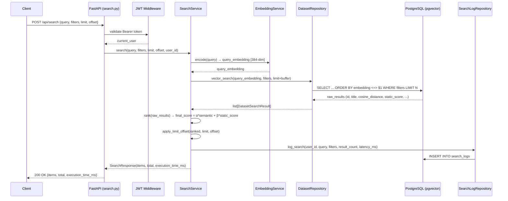
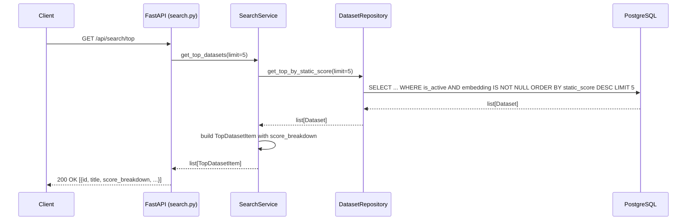
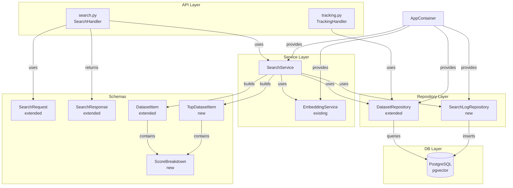

# System Design Document: Dataset Search Feature

**Status:** In Review  
**Author:** [author_name]  
**Date:** 2026-04-09  
**Branch:** `feature/search`

---

## 1. Overview

### Описание фичи

DataSearch агрегирует датасеты из внешних источников (Kaggle, HuggingFace, OpenML), но на данный момент не предоставляет конечным пользователям никакого механизма поиска по ним. Основная бизнес-функция сервиса — семантический поиск датасетов — отсутствует.

Данная фича реализует **полноценный поиск датасетов**: пользователь вводит поисковый запрос на естественном языке, система конвертирует его в векторный эмбеддинг, выполняет поиск ближайших соседей (ANN) в pgvector и возвращает ранжированный список наиболее релевантных датасетов с поддержкой фильтров по источнику, формату файлов и лицензии.

### Бизнес-цели и метрики успеха

| Метрика | Цель |
|---|---|
| Время ответа поискового запроса (p95) | ≤ 500 мс |
| Precision@5 (релевантность топ-5 результатов) | ≥ 0.75 |
| Доля запросов с непустой выдачей | ≥ 90% |
| Индексируемость (доля datasets с embedding) | 100% enriched датасетов |

---

## 2. Цели и Анти-цели

### Цели (Goals)

- Реализовать `POST /api/search` — эндпоинт семантического поиска с фильтрами
- Реализовать `GET /api/search/top` — эндпоинт топ-5 наиболее релевантных датасетов с прозрачными критериями ранжирования
- Реализовать `GET /api/visit/{dataset_id}` — логирование клика и редирект на источник (tracking)
- Добавить в `DatasetRepository` метод векторного поиска через pgvector (`<=>` оператор cosine distance)
- Добавить сервисный слой `SearchService` с логикой гибридного ранжирования (семантическое сходство + `static_score`)
- Расширить `SearchRequest` фильтрами: `source_name`, `file_formats`, `license`, `min_row_count`, `max_size_bytes`
- Расширить `SearchResponse` и `DatasetItem` полем `score_breakdown` для прозрачности ранжирования
- Логировать каждый поисковый запрос в таблицу `search_logs` для аналитики

### Анти-цели (Non-Goals)

- **Персонализация** (ранжирование на основе истории пользователя) — не в этой итерации
- **Полнотекстовый поиск (FTS)** через `tsvector` — используем только семантический поиск
- **Реал-тайм индексация** новых датасетов в момент их появления — индексирование через существующий Celery-пайплайн
- **Кэширование результатов** поиска в Redis — не в MVP; рассмотреть в следующей итерации
- **Автодополнение (autocomplete) / suggest** запросов — отдельная фича
- **Сортировка вручную** (по дате, популярности без семантики) — в этой итерации только семантическое ранжирование

---

## 3. Высокоуровневый дизайн (High-Level Design)

### Sequence Diagram — основной поисковый флоу



### Sequence Diagram — топ-5 датасетов



### Описание основного флоу

1. Клиент отправляет POST-запрос с поисковым запросом и опциональными фильтрами
2. Middleware проверяет JWT токен
3. `SearchService` кодирует запрос в вектор через `EmbeddingService`
4. `DatasetRepository` выполняет ANN-поиск в pgvector с применением SQL-фильтров
5. `SearchService` применяет гибридное ранжирование и пагинацию
6. Результаты логируются асинхронно в `search_logs`
7. Ответ возвращается клиенту

---

## 4. Детальный дизайн (Detailed Design)

### 4.1. Диаграмма компонентов (Component Diagram)



### 4.2. Изменения в схеме данных (Database Schema Changes)

#### Новая таблица: `search_logs`

```sql
CREATE TABLE search_logs (
    id          UUID PRIMARY KEY DEFAULT gen_random_uuid(),
    user_id     UUID NOT NULL REFERENCES users(id) ON DELETE SET NULL,
    query       TEXT NOT NULL,
    filters     JSONB,
    result_count INT NOT NULL DEFAULT 0,
    latency_ms  FLOAT NOT NULL,
    created_at  TIMESTAMPTZ NOT NULL DEFAULT NOW()
);

CREATE INDEX idx_search_logs_user_id ON search_logs(user_id);
CREATE INDEX idx_search_logs_created_at ON search_logs(created_at DESC);
```

#### Изменения в существующей таблице `datasets`

Новых столбцов не требуется — все необходимые поля (`embedding`, `static_score`, `is_active`, `source_name`, `file_formats`, `license`, `row_count`, `total_size_bytes`) уже присутствуют в модели.

**Новый индекс для pgvector ANN-поиска:**

```sql
-- HNSW индекс для быстрого поиска ближайших соседей (cosine distance)
CREATE INDEX idx_datasets_embedding_hnsw
    ON datasets
    USING hnsw (embedding vector_cosine_ops)
    WITH (m = 16, ef_construction = 64)
    WHERE is_active = true AND embedding IS NOT NULL;
```

> **Примечание:** HNSW индекс строится один раз при деплое миграции. При больших объёмах данных (>1M строк) рассмотреть `ivfflat` с `lists = sqrt(count)`.

#### SQLAlchemy модель `SearchLog`

```python
# lib/models/search_log.py
class SearchLog(Base, UUIDMixin):
    __tablename__ = "search_logs"

    user_id: Mapped[UUID] = mapped_column(
        ForeignKey("users.id", ondelete="SET NULL"),
        nullable=False,
        index=True
    )
    query: Mapped[str] = mapped_column(Text, nullable=False)
    filters: Mapped[dict | None] = mapped_column(JSONB, nullable=True)
    result_count: Mapped[int] = mapped_column(nullable=False, default=0)
    latency_ms: Mapped[float] = mapped_column(nullable=False)
    created_at: Mapped[datetime] = mapped_column(
        DateTime(timezone=True),
        nullable=False,
        server_default=func.now(),
        index=True
    )
```

### 4.3. API Endpoints

#### `POST /api/search` — Семантический поиск датасетов

| Поле | Значение |
|---|---|
| **Назначение** | Семантический поиск датасетов по текстовому запросу с фильтрами |
| **URL** | `POST /api/search` |
| **Метод** | `POST` |
| **Аутентификация** | Bearer JWT (обязательна) |

**Request Body:**

```json
{
  "query": "image classification dataset with labels",
  "limit": 10,
  "offset": 0,
  "source_name": "kaggle",
  "file_formats": ["csv", "json"],
  "license": "apache-2.0",
  "min_row_count": 1000,
  "max_size_bytes": 1073741824
}
```

| Поле | Тип | Обязательно | Описание |
|---|---|---|---|
| `query` | string | Да | Поисковый запрос (1–200 символов) |
| `limit` | int | Нет (default: 10) | Кол-во результатов (1–50) |
| `offset` | int | Нет (default: 0) | Смещение для пагинации |
| `source_name` | string | Нет | Фильтр по источнику: `kaggle`, `huggingface`, `openml` |
| `file_formats` | list[string] | Нет | Фильтр по форматам файлов (AND логика) |
| `license` | string | Нет | Фильтр по лицензии |
| `min_row_count` | int | Нет | Минимальное количество строк в датасете |
| `max_size_bytes` | int | Нет | Максимальный размер датасета в байтах |

**Successful Response `200 OK`:**

```json
{
  "items": [
    {
      "id": "3fa85f64-5717-4562-b3fc-2c963f66afa6",
      "source_name": "kaggle",
      "external_id": "user/dataset-name",
      "title": "ImageNet Classification Dataset",
      "description": "Large-scale image classification dataset...",
      "url": "https://kaggle.com/datasets/user/dataset-name",
      "tags": ["image", "classification", "computer-vision"],
      "license": "apache-2.0",
      "file_formats": ["csv", "zip"],
      "row_count": 150000,
      "total_size_bytes": 524288000,
      "download_count": 12500,
      "score": 0.94,
      "score_breakdown": {
        "semantic_score": 0.91,
        "static_score": 0.72,
        "final_score": 0.94
      },
      "created_at": "2024-01-15T10:30:00Z"
    }
  ],
  "total": 42,
  "execution_time_ms": 187.34
}
```

**Error Responses:**

| Код | Описание |
|---|---|
| `401 Unauthorized` | Невалидный или отсутствующий JWT токен |
| `403 Forbidden` | Пользователь неактивен |
| `422 Unprocessable Entity` | Ошибка валидации (пустой query, limit вне диапазона и т.д.) |
| `500 Internal Server Error` | Ошибка эмбеддинга или БД |

---

#### `GET /api/search/top` — Топ-5 датасетов

| Поле | Значение |
|---|---|
| **Назначение** | Возвращает топ-5 наиболее релевантных/популярных датасетов с прозрачными критериями ранжирования |
| **URL** | `GET /api/search/top` |
| **Метод** | `GET` |
| **Аутентификация** | Bearer JWT (обязательна) |

**Successful Response `200 OK`:**

```json
{
  "items": [
    {
      "id": "3fa85f64-5717-4562-b3fc-2c963f66afa6",
      "source_name": "huggingface",
      "title": "Common Voice",
      "url": "https://huggingface.co/datasets/mozilla-foundation/common_voice_11_0",
      "score_breakdown": {
        "download_score": 0.98,
        "like_score": 0.87,
        "view_score": 0.76,
        "recency_score": 0.65,
        "static_score": 0.92
      }
    }
  ]
}
```

**Error Responses:**

| Код | Описание |
|---|---|
| `401 Unauthorized` | Невалидный или отсутствующий JWT токен |
| `500 Internal Server Error` | Ошибка БД |

---

#### `GET /api/visit/{dataset_id}` — Клик и редирект (Tracking)

| Поле | Значение |
|---|---|
| **Назначение** | Логирует переход пользователя на датасет и редиректит на внешний URL |
| **URL** | `GET /api/visit/{dataset_id}` |
| **Метод** | `GET` |
| **Аутентификация** | Bearer JWT (обязательна) |

**Successful Response `302 Found`:**  
`Location: https://kaggle.com/datasets/user/dataset-name`

**Error Responses:**

| Код | Описание |
|---|---|
| `401 Unauthorized` | Невалидный или отсутствующий JWT токен |
| `404 Not Found` | Датасет с указанным ID не найден |

---

### 4.4. Логика сервисного слоя (Service Layer Logic)

#### `SearchService` — новый класс

```python
# lib/services/search/search_service.py

class SearchService:
    def __init__(
        self,
        dataset_repo: DatasetRepository,
        search_log_repo: SearchLogRepository,
        embedder: EmbeddingService,
        logger: logging.Logger
    ): ...

    async def search(
        self,
        session: AsyncSession,
        query: str,
        filters: SearchFilters,
        limit: int,
        offset: int,
        user_id: UUID
    ) -> SearchResponse:
        """
        Main search entrypoint.
        1. Encode query → embedding
        2. Vector search in DB with filters
        3. Hybrid ranking
        4. Log search
        5. Return paginated response
        """

    async def get_top_datasets(
        self,
        session: AsyncSession,
        limit: int = 5
    ) -> list[TopDatasetItem]:
        """Returns top N datasets ordered by static_score."""

    def _rank(
        self,
        results: list[DatasetSearchResult],
        semantic_weight: float = 0.7,
        static_weight: float = 0.3
    ) -> list[DatasetSearchResult]:
        """
        Hybrid ranking: final_score = α * semantic_score + β * static_score
        Both scores are normalized to [0, 1].
        semantic_score = 1 - cosine_distance  (pgvector returns distance, not similarity)
        static_score   = Dataset.static_score (pre-computed during enrichment)
        """

    def _build_score_breakdown(
        self,
        semantic_score: float,
        static_score: float | None,
        alpha: float,
        beta: float
    ) -> ScoreBreakdown:
        """Builds transparent score breakdown for API response."""
```

#### `DatasetRepository` — новые методы

```python
# lib/repositories/dataset.py (extension)

async def vector_search(
    self,
    session: AsyncSession,
    query_embedding: list[float],
    filters: SearchFilters,
    limit: int
) -> list[DatasetSearchResult]:
    """
    Performs cosine similarity ANN search via pgvector.
    Uses HNSW index. Returns datasets with cosine distance.
    SQL: SELECT *, (embedding <=> :vec) AS distance FROM datasets
         WHERE is_active AND embedding IS NOT NULL
           AND [optional filters]
         ORDER BY distance ASC
         LIMIT :limit
    """

async def get_top_by_static_score(
    self,
    session: AsyncSession,
    limit: int = 5
) -> list[Dataset]:
    """
    Returns datasets with highest static_score.
    Requires: is_active=True, embedding IS NOT NULL.
    """
```

#### `SearchLogRepository` — новый класс

```python
# lib/repositories/search_log.py

class SearchLogRepository(BaseRepository[SearchLog]):
    async def create(
        self,
        session: AsyncSession,
        user_id: UUID,
        query: str,
        filters: dict | None,
        result_count: int,
        latency_ms: float
    ) -> SearchLog: ...
```

#### Цепочки вызовов по основным кейсам

**Кейс 1: Поиск с фильтрами**

```
POST /api/search
  → search_datasets() [search.py:handler]
    → SearchService.search(session, query, filters, limit, offset, user_id)
      → EmbeddingService.encode(query)  # sync, CPU-bound
      → DatasetRepository.vector_search(session, embedding, filters, limit + buffer)
        → SQL: embedding <=> :vec ORDER BY distance WHERE source_name, file_formats, ...
      → SearchService._rank(raw_results)
        → _build_score_breakdown() for each result
      → SearchService._paginate(ranked, offset, limit)
      → SearchLogRepository.create(session, ...)  # fire-and-forget style (non-blocking commit)
      → return SearchResponse
```

**Кейс 2: Топ-5 датасетов**

```
GET /api/search/top
  → get_top_datasets() [search.py:handler]
    → SearchService.get_top_datasets(session, limit=5)
      → DatasetRepository.get_top_by_static_score(session, limit=5)
        → SQL: ORDER BY static_score DESC WHERE is_active AND embedding IS NOT NULL
      → build TopDatasetItem with score_breakdown for each
      → return list[TopDatasetItem]
```

**Кейс 3: Клик на датасет (Tracking)**

```
GET /api/visit/{dataset_id}
  → visit_dataset() [tracking.py:handler]
    → DatasetRepository.get_by_id(session, dataset_id)
      → if None: raise 404
    → SearchLogRepository.log_click(session, user_id, dataset_id)
    → return RedirectResponse(dataset.url)
```

#### Edge Cases

| Сценарий | Обработка |
|---|---|
| Query embedding вернул пустой вектор | Raise `500` с логом ошибки |
| Нет датасетов с embedding в БД | Вернуть `SearchResponse(items=[], total=0)` |
| `static_score` равен `None` у датасета | Использовать `0.0` как fallback при ранжировании |
| Фильтры дают 0 результатов | Вернуть пустой ответ, не ошибку |
| `dataset_id` в `/visit/` не существует | `404 Not Found` |
| Запрос содержит только стоп-слова | Вернуть результаты по семантической близости (не ошибку) |
| `offset` > `total` | Вернуть `items=[]`, `total` = реальный total |

### 4.5. Асинхронные задачи (Asynchronous Tasks)

Поисковая функция не требует новых Celery-задач — она синхронна в рамках HTTP-запроса. Связанные фоновые задачи уже существуют:

- **`generate_embeddings_task`** (`lib/worker.py`) — генерация embedding для новых датасетов. Обеспечивает, что новые датасеты становятся доступными для поиска.
- **`compute_static_scores_task`** — **новая задача** (Celery beat / cron), пересчитывает `static_score` для всех активных датасетов на основе `download_count`, `view_count`, `like_count`, `source_updated_at`.

#### Задача: `compute_static_scores_task`

**Расположение:** `lib/worker.py`

**Аргументы:** нет (batch-задача)

**Шаги выполнения:**

1. Получить все активные датасеты с `enrichment_status=enriched` через `DatasetRepository`
2. Для каждого датасета вычислить `static_score` по формуле:
   ```
   static_score = normalize(log1p(download_count)) * 0.5
               + normalize(log1p(view_count)) * 0.3
               + normalize(log1p(like_count)) * 0.2
   ```
   Нормализация — min-max по всей выборке.
3. Batch-update поля `static_score` в таблице `datasets`
4. Логировать количество обновлённых записей

**Обработка ошибок:**

- При ошибке БД — логировать и сделать retry (max 3, backoff 60s)
- Задача идемпотентна — повторный запуск перезапишет те же значения

**Расписание (Celery beat):** раз в 24 часа.

---

## 5. Ключевые аспекты (Key Aspects)

### Безопасность (Security)

- **Аутентификация:** все эндпоинты поиска требуют валидного JWT-токена (`get_current_active_user`). Анонимный доступ запрещён.
- **SQL-инъекции:** все параметры передаются через SQLAlchemy параметризованные запросы. Фильтры не конкатенируются в строку.
- **Вектор запроса:** embedding генерируется на нашей стороне — пользователь не может передать произвольный вектор напрямую.
- **Лимиты:** `limit` ограничен 50, `query` — 200 символами на уровне Pydantic валидации. Это защищает от DoS через перегрузку embedding-модели.
- **Rate limiting:** существующий `RateLimitService` применяется к поисковым эндпоинтам аналогично auth-эндпоинтам.

### Производительность (Performance)

- **Объём данных:** ожидается 100K–1M датасетов. HNSW индекс в pgvector обеспечивает поиск за O(log n).
- **Embedding latency:** `all-MiniLM-L6-v2` кодирует один запрос за ~5–15 мс на CPU. При росте нагрузки рассмотреть GPU-инференс или отдельный embedding-сервис.
- **Буфер выборки:** при векторном поиске запрашиваем `limit * 2` строк из БД (buffer), чтобы после применения ранжирования и фильтрации получить нужное количество. Финальная пагинация применяется после ранжирования.
- **`static_score`**: предвычисляется в фоне (Celery), не рассчитывается на лету при каждом запросе.
- **GIN-индексы для ARRAY-фильтров:** `file_formats` и `tags` (тип `ARRAY(String)`) индексируются GIN-индексами сразу — они включаются в миграцию вместе с HNSW.
  ```sql
  CREATE INDEX idx_datasets_file_formats_gin ON datasets USING gin(file_formats);
  CREATE INDEX idx_datasets_tags_gin ON datasets USING gin(tags);
  ```

### Наблюдаемость (Observability)

**Ключевые события для логирования:**

| Событие | Уровень | Контекст |
|---|---|---|
| Начало поискового запроса | `INFO` | `user_id`, `query`, `filters` |
| Время кодирования запроса | `DEBUG` | `latency_ms` |
| Количество результатов из БД | `DEBUG` | `count`, `filters` |
| Завершение запроса | `INFO` | `user_id`, `result_count`, `total_latency_ms` |
| Ошибка embedding | `ERROR` | `query`, `exception` |
| Ошибка БД при поиске | `ERROR` | `exception` |
| Клик на датасет | `INFO` | `user_id`, `dataset_id` |

**Метрики для мониторинга:**

- `search_requests_total` — счётчик запросов (по статусу: success/error)
- `search_latency_ms` — гистограмма времени ответа
- `search_embedding_latency_ms` — время работы embedding-модели
- `search_results_count` — среднее количество результатов
- `search_empty_results_total` — количество пустых выдач (сигнал о проблемах с индексом)

---

## 6. Стратегия тестирования (Testing Strategy)

### Unit-тесты

Покрывают изолированную бизнес-логику без обращения к БД:

- `SearchService._rank()` — корректность гибридного ранжирования при разных весах α/β
- `SearchService._build_score_breakdown()` — корректность формирования `score_breakdown`
- `SearchService._paginate()` — корректность пагинации (offset, limit, edge cases)
- `DatasetRepository.vector_search()` — корректность формирования SQL-запроса (с моком сессии)
- Pydantic-валидация `SearchRequest` — проверка граничных значений (`limit=0`, `query=""`, `limit=51`)

### Интеграционные тесты

Тестируют реальное взаимодействие компонентов с тестовой БД (PostgreSQL + pgvector):

- `POST /api/search` — полный флоу: запрос → embedding → pgvector → ранжирование → ответ
- `GET /api/search/top` — корректность выборки по `static_score`
- `GET /api/visit/{dataset_id}` — редирект и логирование клика
- Корректность применения фильтров (`source_name`, `file_formats`, `license`)
- Пустая выдача при несуществующих фильтрах
- Запись в `search_logs` после каждого поискового запроса

### End-to-End (E2E) тесты

E2E-тесты нужны для критического happy path сценария:

1. Создать тестового пользователя и получить JWT
2. Убедиться, что в БД есть датасеты с embedding
3. Выполнить `POST /api/search` с реальным запросом
4. Проверить, что `items[0].score >= 0.5` и `execution_time_ms <= 1000`
5. Выполнить `GET /api/visit/{items[0].id}` и проверить `302` редирект

---

## 7. План развертывания и отката (Deployment and Rollback Plan)

### Шаги развертывания

1. **Миграция БД:** создать таблицу `search_logs` и HNSW-индекс на `datasets.embedding`
   ```bash
   alembic upgrade head
   ```
   > Создание HNSW-индекса на большой таблице может занять несколько минут и блокировать таблицу. Выполнять в maintenance window или через `CREATE INDEX CONCURRENTLY`.

2. **Выкатить новый код** (API + Worker) через Docker:
   ```bash
   docker-compose up -d --build api worker
   ```

3. **Убедиться, что все датасеты имеют embedding** — запустить задачу принудительно если нужно:
   ```bash
   docker-compose exec worker celery -A lib.worker call worker.generate_embeddings_task
   ```

4. **Запустить `compute_static_scores_task`** для инициализации `static_score`:
   ```bash
   docker-compose exec worker celery -A lib.worker call worker.compute_static_scores_task
   ```

5. **Smoke test:** выполнить тестовый поисковый запрос и убедиться в корректности ответа.

### Использование Feature Flags

В данной итерации feature flags не используются. Функционал включается через деплой кода. При необходимости поэтапного включения — добавить флаг `SEARCH_ENABLED: bool` в `Settings`.

### План отката (Rollback)

| Проблема | Действие |
|---|---|
| Критическая ошибка в API | `docker-compose up -d --build api` с предыдущим образом |
| Медленные запросы из-за индекса | `DROP INDEX CONCURRENTLY idx_datasets_embedding_hnsw` + rollback кода |
| Ошибка миграции `search_logs` | `alembic downgrade -1` — таблица удаляется, данные теряются (не критично) |
| Проблема с `static_score` | Fallback в `_rank()` использует `0.0` — поиск работает только по семантике |

---

## 8. Решённые вопросы (Decisions Log)

| # | Вопрос | Решение |
|---|---|---|
| 1 | Веса ранжирования α/β | Принято: `α=0.7, β=0.3` |
| 2 | Анонимный поиск | Запрещён — только авторизованные пользователи |
| 3 | Кэширование результатов в Redis | Отложено — вернуться по результатам мониторинга нагрузки |
| 4 | GIN-индексы для `file_formats` / `tags` | Включить сразу в миграцию (см. раздел 5, Производительность) |
| 5 | Механизм фидбека (thumbs up/down) | Не нужен в данной итерации |
| 6 | Буфер выборки `limit * 2` | Оставить `limit * 2`; при необходимости скорректировать по данным `search_empty_results_total` |
| 7 | Расписание `compute_static_scores_task` | Раз в 24 часа — достаточно |
