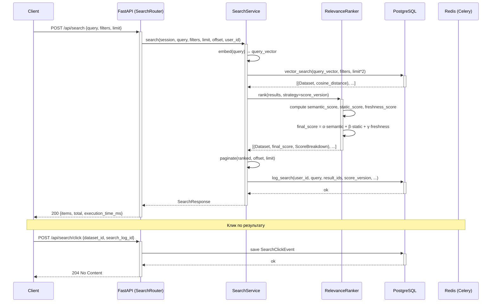

# Актуальный поиск — System Design Document

**Статус:** Draft  
**Дата:** 2026-05-23  
**Автор:** Senior Backend Engineer  
**Связанные документы:** [static-score-design.md](./static-score-design.md)

---

## 1. Обзор (Overview)

### Описание фичи и решаемой проблемы

Текущий поиск использует гибридную формулу: `final_score = 0.7 × semantic + 0.3 × static`. Статический скор — качество датасета (документация, формат, лицензия, популярность). Семантический — косинусное расстояние эмбеддингов.

**Проблема:** релевантность результатов неполная по двум причинам:

1. **Нет сигнала свежести.** Датасет, обновлённый вчера, ранжируется так же, как идентичный по качеству датасет трёхлетней давности. Для ML-инженера актуальность данных критична.
2. **Нет обратной связи от пользователей.** Система не знает, на какой результат кликают, — нет данных для калибровки весов ранжирования. SearchLog не хранит ни показанные результаты, ни клики.

Итог: система не учится. Вся ценность поискового трафика теряется — нет data flywheel.

### Бизнес-цели

- Повысить релевантность выдачи (измеримо через CTR@5 после внедрения click tracking).
- Создать инфраструктуру для data flywheel: click log → offline NDCG@5 → v2 весов.
- Снизить bounce rate (пользователь нашёл нужный датасет с первой страницы).

### Метрики успеха

| Метрика | Baseline | Цель |
|---|---|---|
| CTR@5 (клик на топ-5 результатов) | не измеряется | начать измерять, baseline за 4 недели |
| MRR (mean reciprocal rank по кликам) | не измеряется | baseline за 4 недели |
| Latency p99 `/api/search` | текущее значение | не деградировать (< +10ms) |
| Покрытие click log | 0% поисков | 100% поисков логируют result_ids |

---

## 2. Цели и Анти-цели (Goals and Non-Goals)

### Цели

1. **Freshness signal.** Добавить компоненту свежести в онлайн-ранжирование на основе `source_updated_at`.
2. **Click tracking.** Расширить `SearchLog` для хранения показанных result_ids. Создать `SearchClickEvent` для записи кликов.
3. **Click endpoint.** Переработать `/visit/{dataset_id}` так, чтобы клик записывался в БД с привязкой к поиску.
4. **A/B инфраструктура.** Добавить `score_version` в `SearchLog` и в конфигурацию для поэтапного rollout стратегий ранжирования.
5. **RelevanceRanker.** Вынести логику `_rank()` из `SearchService` в отдельный компонент `RelevanceRanker` для тестируемости и расширяемости.
6. **Обновить ScoreBreakdown.** Добавить `freshness_score` в ответ API для прозрачности ранжирования.

### Анти-цели

- **Персонализация** (user-level ранжирование на основе истории) — не в этой итерации.
- **Онлайн-обучение весов** (LTR, GBDT по кликам в реальном времени) — требует накопленного CTR-датасета, планируется в v2.
- **Переиндексация / перестройка эмбеддингов** — вне скоупа.
- **Смена ML-модели эмбеддингов** — вне скоупа.
- **Query expansion / synonym handling** — вне скоупа v1.
- **UI/фронтенд изменения** — только backend API.

---

## 3. Высокоуровневый дизайн (High-Level Design)

### Диаграмма последовательности



### Основной флоу

1. Клиент делает `POST /api/search`.
2. `SearchService` получает query embedding, запускает vector ANN-поиск (существующий `vector_search`).
3. Результаты (датасеты + cosine distances) передаются в `RelevanceRanker.rank()`.
4. `RelevanceRanker` вычисляет три компоненты: `semantic_score`, `static_score`, `freshness_score`.
5. Итоговый скор: `final_score = α·semantic + β·static + γ·freshness` (веса определяются `score_version`).
6. `SearchService` логирует поиск: query, result_ids в порядке ранжирования, score_version.
7. Когда пользователь кликает на результат, клиент отправляет `POST /api/search/click` — записывается `SearchClickEvent` с привязкой к `search_log_id`, `dataset_id`, позицией клика.

---

## 4. Детальный дизайн (Detailed Design)

### 4.1. Диаграмма компонентов (Component Diagram)

```mermaid
flowchart TD
    Router["SearchRouter\n(lib/services/search/router.py)"]

    subgraph SearchLayer["Search Layer"]
        SS["SearchService\n(search_service.py)"]
        RR["RelevanceRanker\n(relevance_ranker.py)  NEW"]
        FS["FreshnessScorer\n(freshness_scorer.py)  NEW"]
    end

    subgraph RepositoryLayer["Repository Layer"]
        DR["DatasetRepository"]
        SLR["SearchLogRepository\n(extended)"]
        CR["ClickRepository\n(click_repository.py)  NEW"]
    end

    subgraph Models["Models (datasets/models.py)"]
        SL["SearchLog\n(extended: +result_ids, +score_version)"]
        SCE["SearchClickEvent  NEW"]
    end

    Router -->|search()| SS
    Router -->|record_click()| CR
    SS --> DR
    SS --> SLR
    SS --> RR
    RR --> FS
    SLR --> SL
    CR --> SCE
```

### 4.2. Изменения в схеме данных (Database Schema Changes)

#### 4.2.1. Расширение таблицы `search_logs`

```sql
-- migrations/006_extend_search_logs_click_tracking.sql
ALTER TABLE search_logs
    ADD COLUMN result_ids  JSONB,
    ADD COLUMN score_version VARCHAR(30) NOT NULL DEFAULT 'v1_hybrid';

-- result_ids: упорядоченный массив UUID датасетов в выдаче
-- Пример: ["uuid1", "uuid2", "uuid3"]
-- score_version: идентификатор стратегии ранжирования, используемой при поиске

CREATE INDEX idx_search_logs_score_version ON search_logs(score_version);
```

**SQLAlchemy-модель (изменения в `SearchLog`):**

```python
result_ids: Mapped[list[str] | None] = mapped_column(JSONB, nullable=True)
score_version: Mapped[str] = mapped_column(
    String(30), nullable=False, default="v1_hybrid", server_default="v1_hybrid"
)
```

#### 4.2.2. Новая таблица `search_click_events`

```sql
CREATE TABLE search_click_events (
    id           UUID PRIMARY KEY DEFAULT gen_random_uuid(),
    search_log_id UUID REFERENCES search_logs(id) ON DELETE SET NULL,
    user_id      UUID REFERENCES users(id) ON DELETE SET NULL,
    dataset_id   UUID REFERENCES datasets(id) ON DELETE CASCADE NOT NULL,
    position     INTEGER NOT NULL,          -- позиция в выдаче (0-based)
    created_at   TIMESTAMPTZ NOT NULL DEFAULT now()
);

CREATE INDEX idx_click_events_search_log ON search_click_events(search_log_id);
CREATE INDEX idx_click_events_dataset    ON search_click_events(dataset_id);
CREATE INDEX idx_click_events_created_at ON search_click_events(created_at);
```

**SQLAlchemy-модель `SearchClickEvent` (добавить в `datasets/models.py`):**

```python
class SearchClickEvent(Base, UUIDMixin):
    __tablename__ = "search_click_events"

    search_log_id: Mapped[UUID | None] = mapped_column(
        ForeignKey("search_logs.id", ondelete="SET NULL"), nullable=True, index=True
    )
    user_id: Mapped[UUID | None] = mapped_column(
        ForeignKey("users.id", ondelete="SET NULL"), nullable=True
    )
    dataset_id: Mapped[UUID] = mapped_column(
        ForeignKey("datasets.id", ondelete="CASCADE"), nullable=False, index=True
    )
    position: Mapped[int] = mapped_column(Integer, nullable=False)
    created_at: Mapped[datetime] = mapped_column(
        DateTime(timezone=True), nullable=False, server_default="now()", index=True
    )
```

#### 4.2.3. Таблица `datasets` — без изменений

Все нужные поля (`static_score`, `docs_score`, `repr_score`, `social_score`, `legal_score`, `source_updated_at`) уже присутствуют по результатам реализации static-score-design.md.

---

### 4.3. API Endpoints

#### 4.3.1. `POST /api/search` — расширение существующего

**Назначение:** семантический поиск с обновлённой формулой ранжирования.  
**URL:** `POST /api/search`  
**Метод:** POST  
**Аутентификация:** Bearer JWT (существующий `get_current_active_user`)  

**Request Body** (без изменений, `SearchRequest`):
```json
{
    "query": "image classification benchmark",
    "limit": 10,
    "offset": 0,
    "source_name": null,
    "file_formats": ["csv", "parquet"],
    "license": null,
    "min_row_count": null,
    "max_size_bytes": null
}
```

**Successful Response `200 OK`** — `SearchResponse` (изменения в `ScoreBreakdown`):
```json
{
    "items": [
        {
            "id": "uuid",
            "title": "ImageNet 1K",
            "score": 0.87,
            "score_breakdown": {
                "semantic_score": 0.91,
                "static_score": 0.78,
                "freshness_score": 0.82,
                "final_score": 0.87
            }
        }
    ],
    "total": 42,
    "execution_time_ms": 145.3
}
```

**Error Responses:**
- `422 Unprocessable Entity` — невалидный запрос (query пустой, limit > 50)
- `401 Unauthorized` — отсутствует/невалидный токен

---

#### 4.3.2. `POST /api/search/click` — новый endpoint

**Назначение:** записать клик пользователя по результату поиска. Вызывается клиентом **до** перехода по ссылке. Данные идут в data flywheel для калибровки v2.  
**URL:** `POST /api/search/click`  
**Метод:** POST  
**Аутентификация:** Bearer JWT

**Request Body:**
```json
{
    "dataset_id": "uuid",
    "search_log_id": "uuid",
    "position": 2
}
```

**Successful Response `204 No Content`** — пустое тело.

**Error Responses:**
- `404 Not Found` — `dataset_id` не существует
- `422 Unprocessable Entity` — невалидные поля
- `401 Unauthorized`

**Примечание:** `search_log_id` nullable на уровне DB (SET NULL при удалении search_log). Если клиент не передаёт — клик записывается без привязки к сессии поиска.

---

#### 4.3.3. `GET /api/visit/{dataset_id}` — расширение существующего

**Изменения:** теперь endpoint принимает опциональный query-параметр `search_log_id` и `position`. Вызывает `ClickRepository.record_click()` перед redirect.

**URL:** `GET /api/visit/{dataset_id}?search_log_id={uuid}&position={int}`  
**Response:** `302 Redirect` (без изменений)

---

### 4.4. Логика сервисного слоя (Service Layer Logic)

#### 4.4.1. Новый модуль `lib/services/search/freshness_scorer.py`

Вычисляет компоненту свежести на основе `source_updated_at`.

**Формула:**
```
freshness = exp(-ln(2) / halflife_days × age_days)
```
- `age_days=0` → `freshness=1.0`
- `age_days=halflife_days` → `freshness=0.5`
- `age_days=2×halflife_days` → `freshness=0.25`
- `source_updated_at is None` → `freshness=FRESHNESS_DEFAULT` (0.5)

```python
class FreshnessScorer:
    def __init__(self, halflife_days: int = 365):
        self._halflife_days = halflife_days
        self._decay_rate = math.log(2) / halflife_days

    def score(self, source_updated_at: datetime | None) -> float:
        """Returns freshness score in (0, 1]. None → 0.5 (neutral)."""
        if source_updated_at is None:
            return 0.5
        now = datetime.now(timezone.utc)
        age_days = max(0.0, (now - source_updated_at).total_seconds() / 86400)
        return round(math.exp(-self._decay_rate * age_days), 4)
```

**Конфигурация** (добавить в `lib/core/config.py`):
```python
FRESHNESS_HALFLIFE_DAYS: int = 365
RANKING_STRATEGY: str = "v1_hybrid"
```

---

#### 4.4.2. Новый класс `lib/services/search/relevance_ranker.py`

Вынесен из `SearchService._rank()`. Содержит всю логику гибридного ранжирования.

**Стратегии ранжирования (`RankingStrategy`):**

| `score_version` | α (semantic) | β (static) | γ (freshness) | Назначение |
|---|---|---|---|---|
| `v1_hybrid` | 0.70 | 0.30 | 0.00 | текущая формула (backward compat) |
| `v2_freshness` | 0.60 | 0.25 | 0.15 | с сигналом свежести |

```python
RANKING_STRATEGIES: dict[str, tuple[float, float, float]] = {
    "v1_hybrid":    (0.70, 0.30, 0.00),
    "v2_freshness": (0.60, 0.25, 0.15),
}

class RelevanceRanker:
    def __init__(self, freshness_scorer: FreshnessScorer, strategy: str = "v1_hybrid"):
        self._freshness_scorer = freshness_scorer
        self._strategy = strategy

    def rank(
        self,
        results: list[tuple[Dataset, float]],
    ) -> list[tuple[Dataset, float, ScoreBreakdown]]:
        """
        Ranks datasets by hybrid score.
        Returns: [(dataset, final_score, breakdown), ...] sorted desc by final_score.
        """
        ...

    def _compute_scores(
        self,
        dataset: Dataset,
        cosine_distance: float,
    ) -> ScoreBreakdown:
        """Computes semantic, static, freshness, and final scores for one dataset."""
        ...
```

**Сигнатуры методов:**

```python
def rank(
    self,
    results: list[tuple[Dataset, float]],
) -> list[tuple[Dataset, float, ScoreBreakdown]]:
    α, β, γ = RANKING_STRATEGIES.get(self._strategy, RANKING_STRATEGIES["v1_hybrid"])
    ranked = []
    for dataset, cosine_distance in results:
        breakdown = self._compute_scores(dataset, cosine_distance)
        ranked.append((dataset, breakdown.final_score, breakdown))
    ranked.sort(key=lambda x: x[1], reverse=True)
    return ranked

def _compute_scores(
    self,
    dataset: Dataset,
    cosine_distance: float,
) -> ScoreBreakdown:
    α, β, γ = RANKING_STRATEGIES.get(self._strategy, RANKING_STRATEGIES["v1_hybrid"])
    semantic  = max(0.0, 1.0 - cosine_distance)
    static    = dataset.static_score or 0.0
    freshness = self._freshness_scorer.score(dataset.source_updated_at)
    final     = round(α * semantic + β * static + γ * freshness, 4)
    return ScoreBreakdown(
        semantic_score=round(semantic, 4),
        static_score=round(static, 4),
        freshness_score=round(freshness, 4),
        final_score=final,
    )
```

---

#### 4.4.3. Изменения в `SearchService`

`_rank()` удаляется. Добавляется `_ranker: RelevanceRanker` в конструктор.

```python
class SearchService:
    def __init__(
        self,
        dataset_repo: DatasetRepository,
        search_log_repo: SearchLogRepository,
        click_repo: ClickRepository,       # NEW
        embedder: EmbeddingService,
        ranker: RelevanceRanker,           # NEW
        logger: logging.Logger,
    ): ...
```

**Цепочка вызовов в `search()`:**
```
search(session, query, filters, limit, offset, user_id)
  → embedder.encode(query) → query_vector
  → dataset_repo.vector_search(session, query_vector, filters, limit*2)
  → ranker.rank(raw_results) → ranked
  → paginate(ranked, offset, limit)
  → _extract_result_ids(paginated)  # NEW: [str(d.id) for d,_,_ in paginated]
  → search_log_repo.log_search(session, user_id, query, result_ids, score_version, ...)
  → return SearchResponse
```

---

#### 4.4.4. Новый `lib/services/datasets/click_repository.py`

```python
class ClickRepository(BaseRepository[SearchClickEvent]):

    async def record_click(
        self,
        session: AsyncSession,
        user_id: UUID,
        dataset_id: UUID,
        search_log_id: UUID | None,
        position: int,
    ) -> None:
        """Persists a click event."""
        ...
```

---

#### 4.4.5. Изменения в `SearchLogRepository.log_search()`

```python
async def log_search(
    self,
    session: AsyncSession,
    user_id: UUID,
    query: str,
    filters: dict | None,
    result_count: int,
    latency_ms: float,
    result_ids: list[str] | None = None,    # NEW
    score_version: str = "v1_hybrid",       # NEW
) -> SearchLog:                             # return SearchLog for caller to get .id
    ...
```

**Edge cases:**
- `result_ids` пустой список (поиск вернул 0 результатов) → сохраняем `[]`, не `NULL`.
- `score_version` не в `RANKING_STRATEGIES` → fallback к `"v1_hybrid"`, warning в логе.
- `source_updated_at` в будущем (clock skew) → `freshness = 1.0` (clamp age_days ≥ 0).
- `static_score is None` (датасет не прошёл scoring) → `0.0` (как сейчас).

---

#### 4.4.6. Обновление `ScoreBreakdown` в `lib/services/datasets/schemas.py`

```python
class ScoreBreakdown(BaseModel):
    semantic_score:  float
    static_score:    float
    freshness_score: float = 0.0    # NEW (default=0.0 для backward compat)
    final_score:     float
```

---

### 4.5. Асинхронные задачи (Asynchronous Tasks)

В данной итерации **новых Celery-задач не вводится**. Существующий `compute_static_scores` (ежесуточно) остаётся без изменений.

**Обоснование:** freshness вычисляется онлайн в `FreshnessScorer.score()` — это O(1) операция без обращений к БД. Добавлять batch-задачу нецелесообразно до накопления данных о CTR.

**Задел для v2 (будущая работа):**
- Задача `recalibrate_ranking_weights` — grid search / BayesOpt по CTR@5 на накопленном click log.
- Расписание: ручной запуск (не cron) на этапе экспериментов.

---

## 5. Ключевые аспекты (Key Aspects)

### Безопасность (Security)

- **Click endpoint авторизован.** `POST /api/search/click` требует Bearer JWT — анонимные клики не записываются. Это защищает от накрутки click-данных для будущей калибровки.
- **`dataset_id` валидируется в БД** перед записью клика — `404` если датасет не существует, исключает orphaned записи.
- **`search_log_id` nullable.** Клиент может не передавать — данные не теряются, но привязка к сессии пропадает. Атака через несуществующий `search_log_id` игнорируется на уровне FK (SET NULL).
- **CORS**: уже настроен в `lib/main.py` — без изменений для v1.

### Производительность (Performance)

- **`FreshnessScorer.score()` — O(1)**, никаких DB-запросов, одна арифметическая операция. Overhead на 50 результатов в ранжировании < 1ms.
- **`ranker.rank()` — O(n log n)** по числу кандидатов ANN. Аналогично текущему `_rank()`, регрессии нет.
- **`result_ids` в `SearchLog` — JSONB-поле.** Размер: 50 UUID × 36 байт ≈ 1.8 KB/запись — пренебрежимо.
- **Click endpoint** — один `INSERT`, без SELECT. Latency < 5ms.
- **ANN buffer** `limit * SEARCH_BUFFER_MULTIPLIER=2` — не изменяется. Freshness не требует увеличения пула кандидатов в v1.
- **Риск freshness на большом корпусе:** если 80% датасетов имеют `source_updated_at is None`, freshness для них фиксируется на 0.5 — нейтральный скор. Не ломает ранжирование, но снижает дифференциацию. Мониторить процент NULL через `SourceStats`.

### Наблюдаемость (Observability)

**Логирование** (существующий logger, без новых зависимостей):

| Событие | Уровень | Поля |
|---|---|---|
| Поиск выполнен | INFO | query, latency_ms, result_count, score_version |
| Клик записан | INFO | user_id, dataset_id, position, search_log_id |
| dataset_id не найден при клике | WARNING | dataset_id, user_id |
| Неизвестный `score_version` | WARNING | score_version, fallback |
| `source_updated_at` в будущем | WARNING | dataset_id, source_updated_at |

**Метрики для мониторинга** (рекомендуется добавить в dashboard):

- `search_latency_ms` (p50, p95, p99) — не должна расти после деплоя.
- `click_events_per_minute` — baseline после включения фичи.
- `ctr_at_5` (клики / поиски × 100%) — главная метрика успеха.
- `freshness_score_null_ratio` — доля датасетов с `source_updated_at is None`.
- `score_version_distribution` — распределение по стратегиям (для A/B).

---

## 6. Стратегия тестирования (Testing Strategy)

### Unit-тесты

**`tests/unit/test_freshness_scorer.py`**
- `score(None)` → 0.5
- `score(now)` → 1.0 (age=0)
- `score(365 days ago)` ≈ 0.5 (half-life = 365)
- `score(future date)` → 1.0 (clamp)
- Параметризованный: разные `halflife_days`

**`tests/unit/test_relevance_ranker.py`**
- Стратегия `v1_hybrid`: γ=0.00, freshness не влияет на итог
- Стратегия `v2_freshness`: свежий датасет ранжируется выше устаревшего при одинаковых semantic/static
- Сортировка по убыванию `final_score`
- Edge case: пустой список результатов → пустой список
- `static_score=None` → трактуется как 0.0
- Тест на backward compat: `ScoreBreakdown.freshness_score` по умолчанию 0.0

**`tests/unit/test_search_log_repository.py`**
- `log_search()` возвращает `SearchLog` с заполненными `result_ids` и `score_version`
- `result_ids=[]` сохраняется как `[]`, не как NULL

### Интеграционные тесты

**`tests/integration/test_search_flow.py`**
- `POST /api/search` → `SearchLog.result_ids` содержит ID всех возвращённых датасетов в порядке ранжирования
- `POST /api/search` → `SearchLog.score_version` == текущей стратегии из settings
- `POST /api/search/click` → `SearchClickEvent` создан с корректными полями
- `POST /api/search/click` с несуществующим `dataset_id` → `404`
- `GET /api/visit/{dataset_id}?search_log_id=...&position=0` → `SearchClickEvent` создан + redirect

**`tests/integration/test_freshness_in_ranking.py`**
- Два датасета с одинаковыми semantic/static, разным `source_updated_at` → при `v2_freshness` свежий стоит выше

### End-to-End (E2E) тесты

E2E-тесты нецелесообразны в v1 — нет UI. Достаточно интеграционного уровня через httpx TestClient.

---

## 7. План развертывания и отката (Deployment and Rollback Plan)

### Шаги развертывания

1. **Применить миграцию `006_extend_search_logs_click_tracking.sql`**
   - `ALTER TABLE search_logs ADD COLUMN result_ids JSONB, ADD COLUMN score_version ...`
   - `CREATE TABLE search_click_events ...`
   - Миграция non-destructive, backward compatible — колонки nullable/с default.

2. **Деплой нового кода** (API + Worker):
   - `RANKING_STRATEGY=v1_hybrid` — стратегия по умолчанию сохраняет текущее поведение.
   - Никаких breaking changes в ответе API: `freshness_score=0.0` в `ScoreBreakdown` при `v1_hybrid`.

3. **Верификация** (5 минут после деплоя):
   - `POST /api/search` возвращает `score_breakdown.freshness_score`.
   - `SearchLog` в БД содержит `result_ids` и `score_version`.
   - Click endpoint отвечает 204.

4. **Включение `v2_freshness`** (через 2–4 недели после сбора baseline CTR):
   - Изменить `RANKING_STRATEGY=v2_freshness` в env.
   - Перезапустить API.
   - Мониторить `ctr_at_5` и `search_latency_ms`.

### Использование Feature Flags

`RANKING_STRATEGY` — environment variable, не код. Переключение без деплоя (только restart API). Текущее значение логируется в каждом `SearchLog.score_version` — A/B можно анализировать post-hoc по таблице.

### План отката (Rollback)

**Сценарий: деградация latency или ошибки в API после деплоя.**

1. Переключить `RANKING_STRATEGY=v1_hybrid` → restart API. Freshness отключается немедленно.
2. Если проблема в миграции — откат не нужен: новые колонки nullable, старый код игнорирует их.
3. Если проблема в коде `RelevanceRanker` — rollback docker image до предыдущего тега.

**Данные не теряются:** `search_click_events` и расширенные `search_logs` хранятся, используются в v2-калибровке вне зависимости от текущей стратегии.

---

## 8. Открытые вопросы (Open Questions)

1. ~~**Веса `v2_freshness` (α=0.60, β=0.25, γ=0.15)**~~ — **RESOLVED.** Веса приняты, не меняем.

2. ~~**Half-life = 365 дней**~~ — **RESOLVED.** Оставляем 365 дней.

3. **Клиентская интеграция click endpoint.** Фронтенда пока нет. `POST /api/search/click` реализуется на бэкенде в полном объёме; интеграция на усмотрение команды по готовности фронта. До этого момента единственный источник кликов — `/visit/{dataset_id}` с query-параметрами.

4. ~~**Минимальный объём click data для v2-калибровки**~~ — **RESOLVED.** Решаем самостоятельно по факту накопления данных.

5. **`source_updated_at` coverage — проверить до включения `v2_freshness`.** Выполнить запрос на проде перед переключением `RANKING_STRATEGY=v2_freshness`:
   ```sql
   SELECT
       COUNT(*)                                                        AS total,
       COUNT(source_updated_at)                                        AS with_date,
       ROUND(100.0 * COUNT(source_updated_at) / COUNT(*), 1)          AS pct
   FROM datasets
   WHERE is_active = true;
   ```
   Если `pct < 50%` — freshness даёт слабую дифференциацию, включать `v2_freshness` нецелесообразно до улучшения coverage в enrichment-пайплайне.

6. **Хранение `result_ids` для длинных выдач.** Вопрос с партиционированием/TTL `search_logs` откладывается — решим отдельно по мере роста нагрузки.
